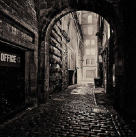
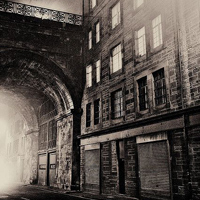
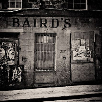
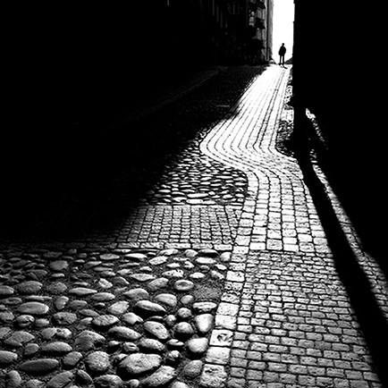
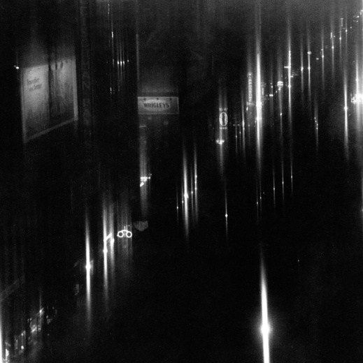
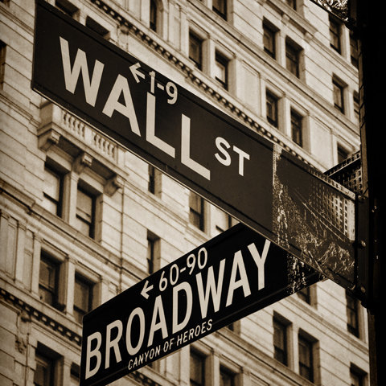

# AAD118

[Book covers](https://www.flickr.com/photos/128425558@N08/sets/72157651004675900/)

## Imaging and Data Visualisation

Imaging and Data Visualisation is a module that explores one of my favourite types of communication, non-verbal. Through only photographic, illustrative and diagrammatic ways a message must be portrayed. This could be difficult yet interesting to see the effects of what the pixels can do, from a perspective of a simple photograph to a purposeful mood board.

## Week one

>“Photography is not about cameras, gadgets and gismos. Photography is about the photographers. A camera didn’t make a great picture any more than a typewriter wrote a great novel” – Peter Adams

During the first week, we were given the introduction of what we will be doing throughout the next twelve weeks. We will have three projects during this semester; a photographic pool, illustrative pool and a diagrammatic pool. For the first project the photography pool, we were given the task of studying architecture of some variety and photograph it from different perspectives. The photographs will be taken in macro and micro, a series of six photos for each section.

The theme that we had to follow was architecture, architecture could be anything, and it was such a broad spectrum to bide by. I initially thought of Belfast’s most iconic buildings and structures, such as the Belfast city hall, Stormont Estate, St Anne’s Cathedral, Grand Opera house, Albert Memorial clock, Belfast Castle, Titanic quarters, and the famed Harland & Wolff’s twin Gantry cranes. I had a large amount of areas all over Northern Ireland that I could have taken pictures, but I thought that Belfast had all that I needed. 

###Macro and Micro

The macro section involves capturing photographs of large spaces, showing vast areas from a distance. Many photos that I came across as macro would depict strong man-made objects and defined landforms throughout the world, but since my theme is architecture, I have to take pictures of buildings and structures and other manufactured objects created by man that are aesthetically pleasing. Macro photographs are usually are the exterior of the building, when taking pictures within a rural area sometimes the surrounding landscape is just as important as the piece of architecture itself.

For the micro section, I have to simply take photos that consist of close-up individual items or objects found within the area that were taken for the macro images.

###Lighting

Lighting is an important aspect to photography, as lighting can completely change the mood and look to a photograph. Photography usually takes place in daylight, best in the morning and evening around an hour and a half after sunrise and before sunset. If photography is done during the night, the use of ambient light, streetlights and moonlight can also create a great effect.

###Viewpoint

A photographs mood can change all down to the alteration of the angle and viewpoint it has been taken. When an image has been captured and the camera is placed on the ground, it gives the image a whole different look, as if the image is much larger, or that it is looking over you. The opposite action can apply as well, looking down at an image, making the subject look smaller or to get its viewpoint.

(image)

###The Rule of Thirds

The rule of thirds is a widely known system used by photographers, as a guideline it can enhance and add appeal to your photographs. When this principle is used the image is equally divided onto nine segments (3x3 grid), two vertical lines and two horizontal, this creates a grid that helps keep the photograph proportionally correct as the cross-section between the lines keeps the picture aligned. Most cameras, even phone cameras include this grid feature. 

(image)

###Once you know the rules, break them.

>“There are no rules for good photographs, there are only good photographs.” – Ansel Adams

From blurry images to strange angles, rules are there to be broken. Once we had learnt all about the guidelines that are out there for beginner photographers, we were allowed to ignore some of the most well known rules out there, such as the Rule of Thirds and experiment!

(image)
(image)

##Photographers

###History

The earliest known surviving photograph, ‘View from the Window at le Gras’ dated way back in 1826. It was captured by Joseph Niépce the French inventor and pioneer of photography. The photograph was taken on a photoengraved printing plate using a camera obscura. 

(image)

###Local

(artist)

###Famous

(artist)

####Ansel Adams

>“A true photograph need not to be explained, nor can it be contained in words” –Ansel Adams

As an environmentalist and photographer Ansel Adams is famously known for his colourless landscape photos of the American West. In 1927, Ansel Adams produced and unleashed his first photographic portfolio, ‘Parmelian Prints of the High Sierras’. 

(artist)

##Week Two

###Harmony and Proportion

During this weeks lecture, we were taught about the harmony and proportion of photography.

###Be Patient

###Travel

### No to Cropping!

### Be unobtrusive

###Photographers I have came across

Here are a list of photographers that have caught my eye, and have inspired me.

####Laurence Winram

Website - http://projects.lwinram.com

Flickr - https://flic.kr/p/4rKs3W

One of the photographers I have stumbled across this week is Laurence Winram. Winram is a Scottish photographer based in Edinburgh. I came across his work when flicking through Pinterest for some inspiration, I really love his collection ‘Edinburgh – Dead of Night’. They have really inspired me to take pictures of the streets in Belfast, I would like to get the enclosed dark feeling he has portrayed in his images, It would perhaps be best capturing pictures at night and relying on the ambient light to highlight nearby objects and cobblestones to get this effect. 

Edinburgh – Dead of Night

####Bror Johansson

http://1x.com/member/2478

I came across Bror Johansson an amateur photographer, he mostly captures images of landscapes, but this one image called ‘Narrow street’ caught my eye, I like the angle he has taken the photo at as it leads your eye up the cobblestone path. I also like the strong contrast between the path and the surrounding area.

Narrow Street

####Edward Steichen

Edward Steichen was a Luxembourgian American Photographer born in 1879. Steichen was known for his work being repeatedly featured in the magazine Camera work throughout 1903 to 1917. I came across one of his Photographs ‘New York City’ I love how the image has a blurred look, it gives an almost dream-like quality to the image.

New York City

####Brain Tuchalski

Brain Tuchalski is an amateur photography and not very well known, he is from New York. I came across one of his photographs of the signage in Wall street & Broadway in New York. I love the effect he has on the image as it looks like a photo from a different decade.

###My Camera

The camera I have used throughout this project is a Fujifilm HS30 exr camera. 

###Photo Time!

After researching and gathering photography tips, it was time to go out and start taking some pictures! Inspired by Laurence Winram I wanted to take night shots of streets, as I thought the streets are truly the history of Belfast. I headed as soon as the sun went down, I walked all around Belfast until I found the perfect place to capture my images. Commercial Court. It was perfect! As the hanging lights gave a great ambient light and bounced of the nearby objects in a dim but Christmas-tree-like way, it gave me slight nostalgia.

##Week Three

##Week Four

##Week Five

##Week Six

##Week Seven

##Week Eight

##Week Nine

##Week Ten

##Week Eleven

##Week Twelve

